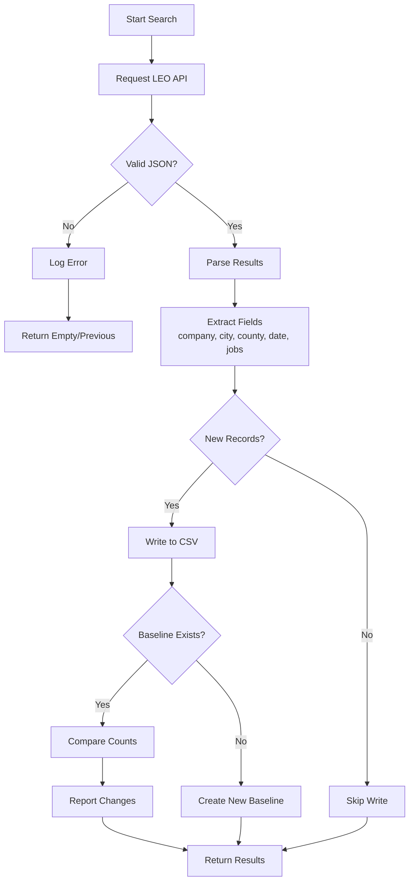

# Warning Notice Scraper

This project scrapes Michigan LEO (Labor Exchange Office) warning notices for layoffs.

## Overview

The scraper monitors `https://www.michigan.gov/leo/` for public layoff notices and extracts key information including:
- Type of company action
- City and County
- Layoff date
- Number of jobs impacted

## Notes
- Each company has different HTML results. So, this can only parse a handful.

## Files
- `search_warn.py` - Main scraper script using requests library

## Usage

```bash
# Search for a specific company
python search_warn.py -q "Company" -o company_results.csv
```

## Configuration

The scraper uses fixed UUIDs from the Michigan LEO API:
- Search UUID: `8E97AB1D-D2D4-47F8-8CC4-3F1039C8854F`
- Item UUID: `BE81F7C2-36A8-4FDE-853C-B05B6E090055`
- View UUID: `1FFFCC21-5151-4A2B-ABFC-F7FE4E5C9783`

## Important Notes

- **Rate limiting**: Respect the API's rate limits. Add delays between requests if multiple searches are run.
- **Headers**: The scraper must include specific headers (User-Agent, Accept-Language, X-Requested-With) to mimic a browser request.
- **Baselines**: Results are compared against `.baseline` files to detect new/deleted records. Update baselines carefully.
- **CSV output**: Results are saved to CSV with headers for easy analysis.
- **Error handling**: The scraper handles non-JSON responses and HTTP errors gracefully.

## Workflow



## Output

- Main results: `leo_search_results.csv` (all results)
- Per-query results: `{query}_results.csv` (most recent record)
- Baseline files: `{query}_results.baseline` (record count for comparison)