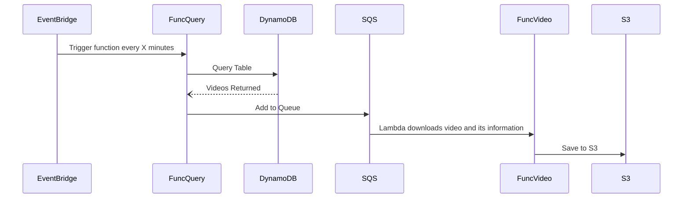

# Read Me

# Flow

```mermaid
sequenceDiagram
EventBridge->>FuncQuery: Trigger function every X minutes
FuncQuery->>DynamoDB: Query Table
DynamoDB--)FuncQuery: Videos Returned
FuncQuery->>SQS: Add to Queue
SQS->>FuncVideo: Lambda downloads video and its information
FuncVideo->>S3: Save to S3
```